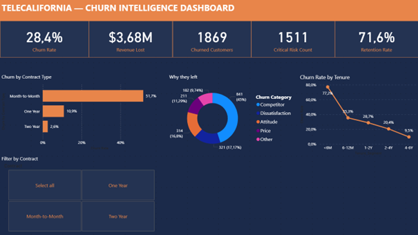
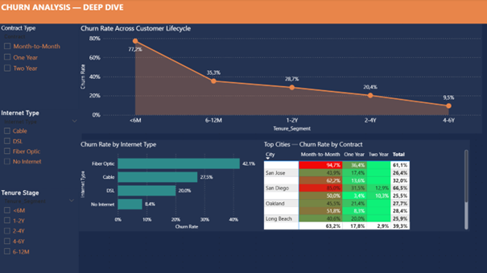
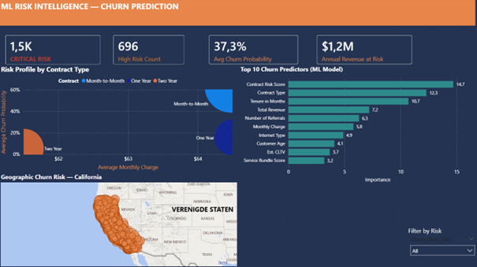
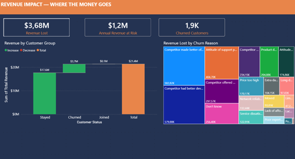
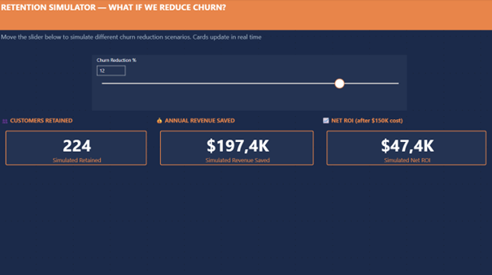

<<<<<<< HEAD
# 📊 TeleCalifornia — Customer Churn Intelligence

> **28.4% of customers are leaving — and they're the highest-paying ones.**  
> This project identifies *who* will churn, *why*, and *how to stop it* — backed by a machine learning model with AUC 0.9251.


---

## 🎯 Business Problem

TeleCalifornia (a California-based telecom serving 7,043 customers) is losing **$3.68M** in total revenue to churn.
Worse: the customers who leave are paying **$73.43/month** — 15% more than those who stay.

This analysis answers four questions leadership needs:
1. What is our exact churn rate and revenue impact?
2. Which customer segments are most at risk — and why?
3. Can we predict *who* will churn before they leave?
4. What retention programs will give the best ROI?

---

## 📈 Key Findings at a Glance

| Metric | Value |
|--------|-------|
| Overall Churn Rate | **28.4%** (industry avg: ~20%) |
| Revenue Lost to Churn | **$3.68M** |
| Month-to-Month Churn Rate | **51.7%** vs 2.6% for 2-Year contracts |
| New Customer Churn (0–6M) | **77.2%** — the critical danger zone |
| ML Model AUC | **0.9251** (5-fold CV: 0.9281 ± 0.005) |
| Critical Risk Customers | **1,511** customers flagged for immediate action |

---

## 💾 Dataset

- **Source:** Maven Analytics Telco Customer Churn Dataset (Kaggle)
- **Size:** 7,043 customers × 38 original features
- **3 files joined:** Customer data + ZIP code population + data dictionary
- **Feature engineering:** 15 new columns created (Contract_Risk, Est_CLTV, Tenure_Segment, etc.)

---

## 🛠️ Tools & Technologies

| Area | Tool |
|------|------|
| Data Cleaning & EDA | Python (pandas, numpy) |
| Machine Learning | scikit-learn (Random Forest) |
| Dashboard | Power BI (5 pages + live Simulator) |
| Excel Report | openpyxl (6-tab Big Four-style report) |
| Visualization | matplotlib, seaborn |

---

## 🤖 Machine Learning

**Algorithm:** Random Forest Classifier  
**Target:** Churn (binary: 1 = churned, 0 = stayed/new)

| Metric | Score |
|--------|-------|
| AUC-ROC | **0.9251** |
| 5-Fold CV AUC | **0.9281 ± 0.005** |
| Accuracy | 85.1% |
| Precision (churn class) | 73% |
| Recall (churn class) | 76% |

**Top 5 Churn Predictors:**
1. Contract Risk Score (14.7%)
2. Contract Type (12.3%)
3. Tenure in months (10.7%)
4. Total Revenue (7.2%)
5. Number of Referrals (6.3%)

---

## 🖥️ Dashboard Preview

*Power BI dashboard — 5 interactive pages. Download the `.pbix` file from `output/` to explore in Power BI Desktop (free).*

### Page 1 · Executive Overview
> 5 KPI cards · Churn by contract · Churn reasons donut · Tenure trend line chart · Contract slicer



---

### Page 2 · Churn Analysis Deep Dive
> Lifecycle area chart · Churn by internet type · Top cities heatmap matrix · 3 filter slicers



---

### Page 3 · ML Risk Intelligence
> Bubble risk map · Feature importance chart · Geographic map · 4 KPI cards



---

### Page 4 · Revenue Impact
> Revenue waterfall by customer group · Revenue lost by churn reason treemap



---

### Page 5 · Retention Simulator
> Live what-if slider · Customers retained · Revenue saved · Net ROI — all update in real time



---

## 💡 Strategic Recommendations

| Priority | Action | 
|----------|--------|
| 🔴 CRITICAL | Contract Upgrade Campaign (M-t-M → 1yr) 
| 🔴 CRITICAL | Onboarding Excellence (0–6M programme)
| 🔴 CRITICAL | Fiber Optic Retention Programme 
| 🟠 HIGH | Pause Offer E immediately (67.6% churn!) 
| 🟠 HIGH | Competitive Device Programme 

ROI modelling uses the Retention Simulator on Page 5 — adjust the slider to model different scenarios based on actual churn and revenue data.

---

## 📁 Repository Structure

```
telecalifornia-churn-analysis/
├── data/                          # Clean, engineered dataset (57 columns)
├── output/                        # Excel report + A4 print report + .pbix file
├── visuals/                       # Dashboard screenshots (5 pages)
├── docs/                          # Step-by-step tutorial guides
├── churn_analysis.py              # Full Python pipeline
├── requirements.txt               # Python dependencies
└── README.md
```

---

## 🚀 Reproduce This Analysis

```bash
# 1. Clone the repo
git clone https://github.com/Ying-Data/telecalifornia-churn-analysis.git
cd telecalifornia-churn-analysis

# 2. Install dependencies
pip install -r requirements.txt

# 3. Add the raw data files to data/ (download from Kaggle link below)
# https://www.kaggle.com/datasets/shilongzhuang/telecom-customer-churn-by-maven-analytics

# 4. Run the full pipeline
python churn_analysis.py
```

**To explore the dashboard:**
1. Download `output/TeleCalifornia_Churn_Dashboard.pbix`
2. Open it in [Power BI Desktop](https://powerbi.microsoft.com/desktop/) (free)
3. Go to Transform Data → update the CSV file path to your local machine

---

## 👩‍💻 About

**Ying Zhao** — Data Analyst based in Antwerp, Belgium  
Specializing in Business Intelligence, Power BI, Python, and end-to-end data storytelling.

[](https://linkedin.com/in/weiying-zhao)
[](https://github.com/Ying-Data)
[](mailto:weiying.data@gmail.com)

---
*Analysis conducted in April 2026 · Dataset: Maven Analytics Telco Churn*
=======
# telecalifornia-churn-analysis
End-to-end customer churn prediction for a California telecom — EDA, ML (AUC 0.93), Power BI dashboard &amp; strategic ROI recommendations
>>>>>>> e16935aebec5e097056e66ca48250b504f672478
