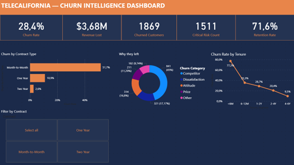
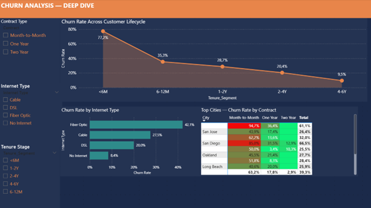
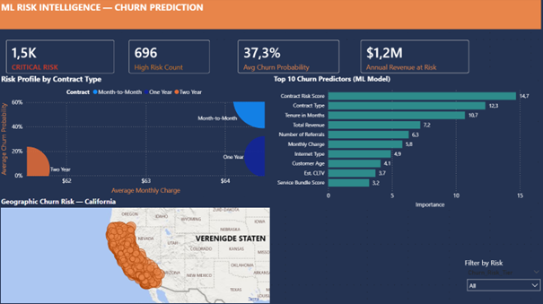
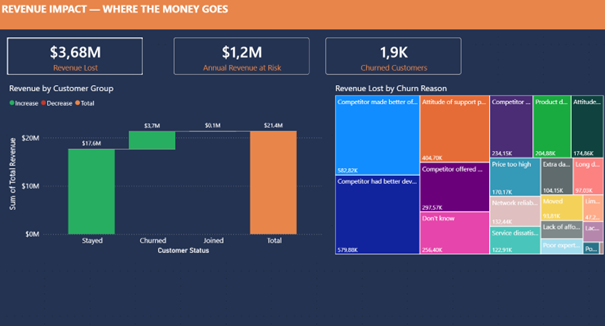
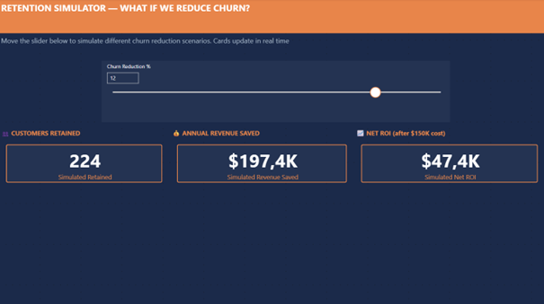

# TeleCalifornia, Customer Churn Intelligence

**28.4% of customers are leaving, and they are the highest-paying ones.** This project identifies who will churn, why, and how to stop it, backed by a Random Forest model with an AUC of 0.9251.


## Business problem

TeleCalifornia, a California telecom serving 7,043 customers, is losing **$3.68M** in total revenue to churn. The customers who leave pay **$73.43/month**, 15% more than those who stay. Four questions drive the analysis:

1. What is the exact churn rate and revenue impact?
2. Which customer segments are most at risk, and why?
3. Can we predict who will churn before they leave?
4. Which retention programmes give the best ROI?

## Key findings

| Metric | Value |
|--------|-------|
| Overall churn rate | **28.4%** (industry average is roughly 20%) |
| Revenue lost to churn | **$3.68M** |
| Month-to-month churn rate | **51.7%** vs 2.6% for two-year contracts |
| New-customer churn (0 to 6 months) | **77.2%**, the critical danger zone |
| ML model AUC | **0.9251** (5-fold CV: 0.9281 +/- 0.005) |
| Critical-risk customers flagged | **1,511** |

## Dataset

- **Source:** Maven Analytics Telco Customer Churn dataset (Kaggle)
- **Size:** 7,043 customers, 38 original fields
- **Three files joined:** customer data, ZIP-code population, data dictionary
- **Feature engineering:** 16 columns engineered (Contract_Risk, Est_CLTV, Tenure_Segment, and others)

## Tools

| Area | Tool |
|------|------|
| Data cleaning and EDA | Python (pandas, numpy) |
| Machine learning | scikit-learn (Random Forest) |
| Dashboard | Power BI (5 pages plus a live simulator) |
| Excel report | openpyxl (6-tab workbook) |
| Visualization | matplotlib, seaborn |

## Machine learning

**Algorithm:** Random Forest classifier. **Target:** churn (1 = churned, 0 = stayed).

| Metric | Score |
|--------|-------|
| AUC-ROC | **0.9251** |
| 5-fold CV AUC | **0.9281 +/- 0.005** |
| Accuracy | 85.1% |
| Precision (churn class) | 73% |
| Recall (churn class) | 76% |

**Top 5 churn predictors:**
1. Contract risk score (14.7%)
2. Contract type (12.3%)
3. Tenure in months (10.7%)
4. Total revenue (7.2%)
5. Number of referrals (6.3%)

> **Model integrity:** a few monetary features (Total Revenue, estimated CLTV) are correlated with tenure and therefore partly endogenous to the outcome, so the headline AUC is read conservatively. A production model would exclude any field generated after the churn decision and be validated on a forward time split rather than a random one. Reported here, this is a deliberate caveat rather than an oversight.

## Dashboard preview

Five interactive Power BI pages. Download `output/TeleCalifornia_Churn_Dashboard.pbix` and open it in Power BI Desktop (free).

### Page 1, Executive Overview
5 KPI cards, churn by contract, churn-reasons donut, tenure trend, contract slicer.


### Page 2, Churn Analysis Deep Dive
Lifecycle area chart, churn by internet type, top-cities heatmap, three slicers.


### Page 3, ML Risk Intelligence
Bubble risk map, feature-importance chart, geographic map, four KPI cards.


### Page 4, Revenue Impact
Revenue waterfall by customer group, revenue lost by churn reason.


### Page 5, Retention Simulator
Live what-if slider for customers retained, revenue saved, and net ROI.


## Strategic recommendations

| Priority | Action |
|----------|--------|
| Critical | Contract upgrade campaign (month-to-month to one year) |
| Critical | Onboarding excellence programme for the first 6 months |
| Critical | Fiber-optic retention programme |
| High | Pause Offer E (67.6% churn) pending review |
| High | Competitive device trade-in programme |

ROI is modelled on Page 5 of the dashboard; adjust the slider to test scenarios against actual churn and revenue data.

## Repository structure

```
telecalifornia-churn-analysis/
├── data/                  Clean, engineered dataset (57 columns)
├── output/                Excel report, A4 print report, and .pbix dashboard
├── visuals/               Dashboard screenshots (5 pages)
├── docs/                  methodology.html, a one-page methodology and how-to-explore guide
├── churn_analysis.py      Full Python pipeline
├── requirements.txt       Python dependencies
└── README.md
```

## Reproduce this analysis

```bash
git clone https://github.com/Ying-Data/telecalifornia-churn-analysis.git
cd telecalifornia-churn-analysis
pip install -r requirements.txt

# Add the raw Kaggle files to data/ (link below), then run:
python churn_analysis.py
```

Dataset: [Telecom Customer Churn by Maven Analytics](https://www.kaggle.com/datasets/shilongzhuang/telecom-customer-churn-by-maven-analytics).

For the full methodology and a guide to exploring the dashboard, see [docs/methodology.html](docs/methodology.html).

## About

**Ying Zhao**, Data Analyst based in Antwerp, Belgium. Business intelligence, Power BI, Python, and end-to-end data storytelling.

[](https://linkedin.com/in/weiying-zhao)
[](https://github.com/Ying-Data)
[](mailto:weiying.data@gmail.com)
